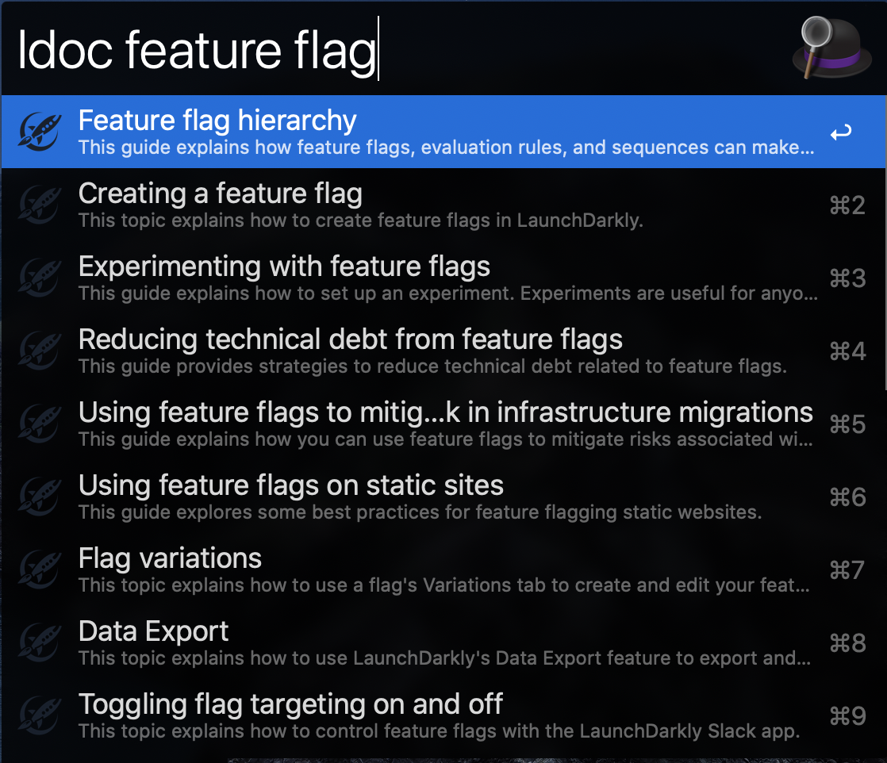

# alfred-workflow-launchdarkly-docs
Alfred workflow which allows you to search LaunchDarkly documentation.



## Dependencies
- jq - jq is a lightweight and flexible command-line JSON processor


## Installation

1. [Install jq](https://stedolan.github.io/jq/download/)
2. Download and import the `launchdarkly_documentation.alfredworkflow`.
4. Optionally, if `jq` is in a non-standard location, set JQPATH. For example: `/usr/lib/bin`. This shouldn't be necessary in 99% of cases.

You can get the JQPATH via `which` command.
```sh
$ which jq
/usr/local/bin/jq
```
:fire: Note that `/usr/local/bin` is your JQPATH instead of `/usr/local/bin/jq`

## Usage

`ldoc Feature Flag`

---
Thanks to [alfred-bitly-workflow](https://github.com/GimmyHchs/alfred-workflow-bitly) for providing similar steps.
